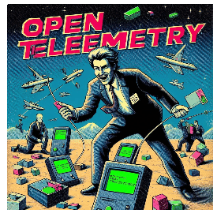

# ASTRONAUGHTS PRESENT

<!---
  _______       __       ___      ___   _______  _______     ______  ___  ___  ________  ____  ____   __  ___________  ________  
 /" _   "|     /""\     |"  \    /"  | /"     "||   _  "\   /    " \|"  \/"  |/"       )("  _||_ " | |" \("     _   ")/"       ) 
(: ( \___)    /    \     \   \  //   |(: ______)(. |_)  :) // ____  \\   \  /(:   \___/ |   (  ) : | ||  |)__/  \\__/(:   \___/  
 \/ \        /' /\  \    /\\  \/.    | \/    |  |:     \/ /  /    ) :)\\  \/  \___  \   (:  |  | . ) |:  |   \\_ /    \___  \    
 //  \ ___  //  __'  \  |: \.        | // ___)_ (|  _  \\(: (____/ // /   /    __/  \\   \\ \__/ //  |.  |   |.  |     __/  \\   
(:   _(  _|/   /  \\  \ |.  \    /:  |(:      "||: |_)  :)\        / /   /    /" \   :)  /\\ __ //\  /\  |\  \:  |    /" \   :)  
 \_______)(___/    \___)|___|\__/|___| \_______)(_______/  \"_____/ |___/    (_______/  (__________)(__\_|_)  \__|   (_______/   
-->

💀♝♝♝♝♝♝♝♝♝♝♝♝♝♝♝♝♝♝♝♝♝♝♝♝♝♝♝♝♝♝♝♝♝♝♝♝💀

2024 DROP! TEAM ASTRONAUGHTS PRESENTS

💀♝♝♝♝♝♝♝♝♝♝♝♝♝♝♝♝♝♝♝♝♝♝♝♝♝♝♝♝♝♝♝♝♝♝♝♝💀

# GameboySuits

Cut that build time and get that Java app instrumented with `ghcr.io/otel-warez/gameboysuits:latest`.

## What's the point

This shows how to fix https://github.com/open-telemetry/opentelemetry-operator/issues/3231 for good and in style.

## Yes and

But also we have a nice Github actions build to test this to boot

## But also

We have here the bare minimum to deploy the operator. It's all native Kubernetes .yaml files under test for your viewing pleasure.
